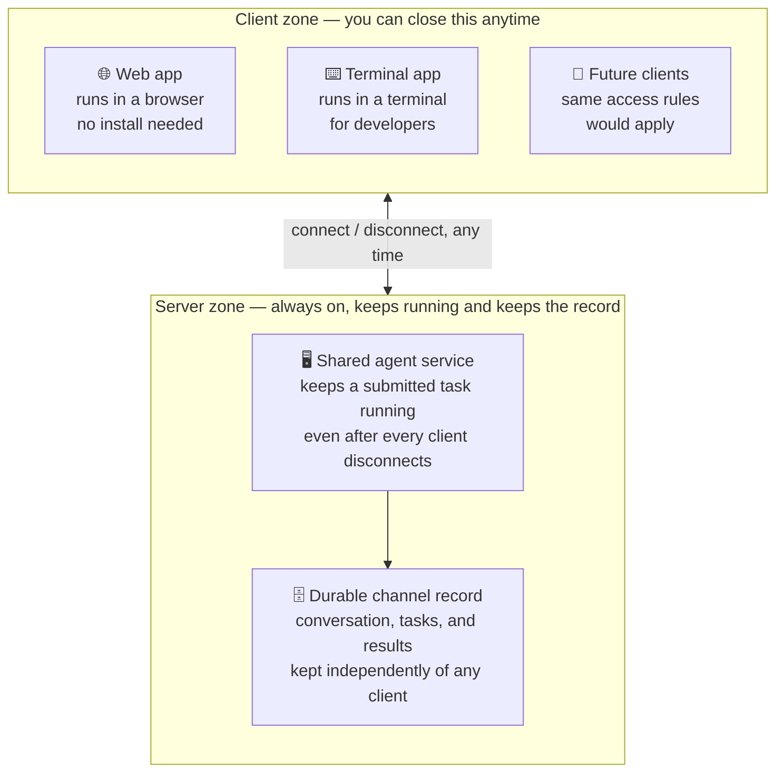

<div align="center">
  

  <h1>Tossakan AI — Releases</h1>

  <p><strong>Collaborative AI teamwork — available from a web browser and a terminal.</strong></p>

  <p>
    
    
    
  </p>
</div>

---

> [!NOTE]
> This repository ships **release binaries only**. The application source code lives in a
> separate private repository. GitHub automatically attaches **"Source code (zip)"** and
> **"Source code (tar.gz)"** links to every release — those are auto-generated snapshots of
> **this repository's own files** (this README + assets), **not** the application's source
> code. Safe to ignore.

## Install

### macOS / Linux

**Option A — GitHub CLI:**
```bash
gh release download latest --repo IAM-SuperBoy/tossakan-ai-releases -p 'install.sh' --output - | sh
```

**Option B — curl:**
```bash
curl -fsSL https://github.com/IAM-SuperBoy/tossakan-ai-releases/releases/latest/download/install.sh | sh
```

### Windows PowerShell

**Option A — GitHub CLI:**
```powershell
gh release download latest --repo IAM-SuperBoy/tossakan-ai-releases -p 'install.ps1' --output install.ps1; .\install.ps1
```

**Option B — irm:**
```powershell
irm https://github.com/IAM-SuperBoy/tossakan-ai-releases/releases/latest/download/install.ps1 | iex
```

## Update

Re-run the install command to update to the latest release.

## Uninstall

### macOS / Linux

**Option A — GitHub CLI:**
```bash
gh release download latest --repo IAM-SuperBoy/tossakan-ai-releases -p 'uninstall.sh' --output - | sh
```

**Option B — curl:**
```bash
curl -fsSL https://github.com/IAM-SuperBoy/tossakan-ai-releases/releases/latest/download/uninstall.sh | sh
```

### Windows PowerShell

**Option A — GitHub CLI:**
```powershell
gh release download latest --repo IAM-SuperBoy/tossakan-ai-releases -p 'uninstall.ps1' --output uninstall.ps1; .\uninstall.ps1
```

**Option B — irm:**
```powershell
irm https://github.com/IAM-SuperBoy/tossakan-ai-releases/releases/latest/download/uninstall.ps1 | iex
```

## Supported platforms

| OS | Architecture |
|---|---|
| macOS | Apple Silicon (arm64) |
| Linux | x86_64, arm64 |
| Windows | x86_64, arm64 |

---

## What is Tossakan?

Tossakan turns an AI assistant into a **shared team resource** instead of a single-player tool.
A central service holds the credentials and the project context; a team connects to it through a
**web app in the browser** (no install needed) or a **terminal-based client** — either way, a
whole group — engineers, product managers, and other business stakeholders alike — sees the
**same** conversation, the **same** list of work in progress, and the **same** AI output as it
happens. A stakeholder doesn't need to read code or open a terminal to follow a decision, ask a
question, or steer scope — they read the same shared conversation a developer is already working
in, from whichever way they prefer to connect.

> **The single biggest benefit:** an AI assistant stops being a private, single-player tool and
> becomes a shared team resource — visible, joinable, and auditable by the whole team, not just
> the person typing.

## How a request flows

1. A developer or stakeholder sends a request in a shared channel (from the browser or the terminal).
2. The shared agent service picks it up — everyone in the channel sees the same conversation.
3. Complex work is captured as a **plan** made of steps with explicit dependencies.
4. Independent steps (or long research) can run as **isolated helper tasks** so they never block
   or crowd out the main conversation.
5. The AI uses real tools — editing files, tracking tickets, checking in code, messaging the
   team, browsing the web — against a choice of AI models.
6. The output lands back in the shared channel, visible to everyone, and becomes part of the
   durable record.

## Project → Channel → Topic

Work is organized in three nested levels:

```
Project                    ← the overall codebase/workspace
└── Channel                ← a shared room the whole team watches (e.g. #general, #payments)
    └── Topic              ← a focused side-thread inside a channel
```

- A **Project** is the outermost scope — everything below belongs to one project.
- A **Channel** is a shared room within a project. Everyone connected to it — developers and
  stakeholders alike — sees the same live conversation and the same list of work in progress.
- A **Topic** is a focused side-thread *inside* a channel — a way to branch off exploratory work
  (e.g. "try approach B") without derailing or losing the channel's main conversation.

**Topic and "idea" are the same thing, two names for one level:** *Topic* is the user-facing name
you see in the UI; *idea* is the same concept's internal/technical name (used in commands like
`/idea <name>` to create or switch topics, and in the underlying data model). There's no
separate hidden layer — when you switch to a topic, you are switching the active "idea" the
channel is working on. Shared memory follows this same hierarchy too, scoped from narrowest to
broadest: topic (idea) → channel → project → global.

## Where to run it

Tossakan runs in two modes — pick the one that matches how much of the "collaborative" story you want:

| | **Local** (on your own machine) | **Server** (deployed centrally) |
|---|---|---|
| Feels like | A regular coding agent — just you | A shared team resource everyone connects to |
| Who sees the conversation | Only you | The whole team, in real time |
| Access | Terminal client only | Terminal client **and** web browser, from anywhere |
| State survives disconnect | No — tied to your local session | Yes — the server keeps running and keeps the record |
| Best for | Solo experimentation, personal workflow | Fully collaborative AI teamwork across a whole team |

Installing locally is the fastest way to try Tossakan the same way you'd try any coding agent.
Installing on a server unlocks the full collaborative model described in this README — a shared
channel the whole team, technical or not, can watch and join from a browser or a terminal.

### Why server mode's persistence matters

| Benefit | What it means in practice |
|---|---|
| 🔌 **Disconnect anytime, work keeps going** | Close your laptop or lose your connection mid-task — the agent keeps running on the server. Reconnect later (same client or a different one) and the finished result is waiting for you. |
| 🔁 **Server restarts don't lose your place** | If the server process itself stops and comes back, in-flight plans and tasks are automatically picked back up — you don't have to remember or re-explain where you left off. |
| 🧑‍🤝‍🧑 **One shared source of truth** | Every teammate reconnecting sees the exact same conversation and results — nobody is stuck with a stale local copy or has to re-ask what happened while they were away. |
| 🕵️ **Nothing is lost to a cleared screen** | Clearing what a client displays only trims the *view* — the durable record on the server is untouched and still there to look back on. |
| 📈 **A growing, searchable history** | Because the record lives on the server rather than in any one person's session, it accumulates into a full project history instead of resetting every time someone closes their app. |

## Architecture — what lives on the server vs. what you access from a client



Everything a client shows is a **view** onto state that actually lives in the server zone. A
user can disconnect the moment a task is submitted and reconnect later — from the same client or
a different one — to see the finished result. Clearing the visible conversation (starting fresh
context) only trims what a client shows going forward — it does not touch the durable record in
the server zone, which stays available to look back on.

## Core building blocks

### Collaboration

| | |
|---|---|
| 🧵 **Channels & Topics** | A channel is a shared room; a topic is a focused side-thread inside it — branch off exploratory work without losing the main conversation. See [Project → Channel → Topic](#project--channel--topic) below. |
| 🌐💻 **Two ways to connect** | The same service backs a browser-based web app and a terminal client — pick whichever fits; history is identical either way. |
| 🧩 **Sub-agents & delegation** | Delegate a piece of work to a sub-agent that runs it separately — long research or a big task never blocks or crowds out the main conversation. |
| 🗂️ **Trackable plans & tasks** | Work is captured as a plan made of tracked tasks with explicit dependencies (todo → in progress → done) — independent tasks run in parallel, dependent ones wait. |
| 🤖 **Choice of AI models** | Anthropic (Claude) · OpenAI (GPT) · Google (Gemini) · Amazon Bedrock (incl. Bedrock Mantle) · Microsoft Azure OpenAI · DeepSeek · Meta (Muse Spark) · GitHub Copilot · self-hosted/local (Ollama). |
| 🛠️ **Real tools, not just chat** | The AI edits files, tracks tickets, checks in code, sends team messages, and browses the web — not just suggestions. |
| 📖 **Reusable playbooks** | Named, repeatable playbooks for recurring work (planning, reviewing, looking things up). |
| 🧠 **Shared memory** | Facts saved at four nested levels (topic → channel → project → global), narrowest match wins. |
| 🕓 **Full historical record** | Every message, decision, and AI action is a persistent, searchable record — not a disappearing chat. |
| 🌍 **Multi-language support** | Works in any language you write in — the AI's response language follows whichever LLM/model is active, since language handling varies model to model. |
| 🔐 **Google & GitHub SSO** | Sign in with your existing Google or GitHub account — no separate credentials to manage for the team. |

### Insight & tooling

| | |
|---|---|
| 📊 **Usage stats** | Built-in stats on activity and AI usage across the channel — see what's happening at a glance. |
| 💰 **Per-person cost allocation** | Cost is broken down and attributed to each individual, not just a single team-wide total. |
| 🗺️ **Built-in code graph** | Indexes the codebase for structural lookups, and keeps the index updated as the code changes — no separate indexing step to remember. |

## Who sees what

| Role | What they see |
|---|---|
| **Everyone in the channel** | The same live conversation, plan/task progress, and AI output — regardless of how they connect. |
| **Org admin** | Full usage logs and conversation history across the organization, including per-person stats and cost allocation. |
| **Sub-agents** | Run isolated from the main conversation — their detailed work doesn't clutter the shared thread, only the result does. |
| **The AI** | The same shared project context and credentials every team member is already working against — no separate, siloed setup per person. |

## Durable record

Every message, decision, and AI action is kept as a persistent record per channel — not an
ephemeral chat session. Planned ahead: semantic search over past discussion, and a full audit
trail of AI actions.

---

<div align="center">
  <sub>Tossakan AI — collaborative AI, available from both a web browser and a terminal.</sub>
</div>
